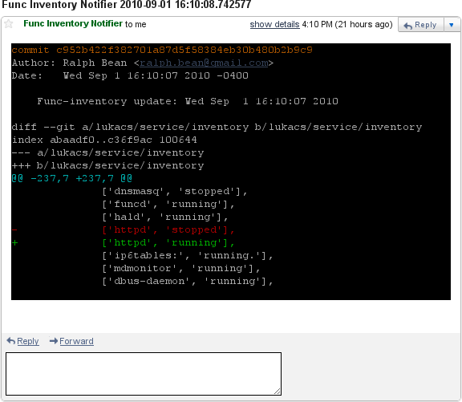

==============================================================================
func-inventory-notifier : send colorized HTML emails of func-inventory changes
==============================================================================
:Author: Ralph Bean <ralph.bean@gmail.com>

----

(or)

.. image:: func-inventory-notifier/raw/master/doc/images/screenshot1.png

Get up and running with func-inventory-notifier
===============================================

.. _func: https://fedorahosted.org/func/
.. _func-inventory: https://fedorahosted.org/func/wiki/FuncInventory    

To begin with, read about `func`_ and especially `func-inventory`_ if
you don't yet know what they are.

.. _func installed: https://fedorahosted.org/func/wiki/InstallAndSetupGuide

Make sure you have `func installed`_ and working as you please.

Install func-inventory-notifier with:

  ``pip install func-inventory-notifier``

..  ``yum install func-inventory-notifier``

Configure func-inventory notifier by editing 
``/etc/func/func-inventory-notifier.conf``

Take it for a spin by running ``/usr/bin/func-inventory-notifier``

----

It is particularly useful when scheduled to run regularly with cron.
For instance, with a default installation of both *func* and
*func-inventory-notifier*, a crontab entry like

   ``0 * * * * /usr/bin/func-inventory-notifier &> /dev/null``

will wake up on the hour, monitor *func-inventory*'s git repository, and
if a change has happened, prepare and fire off an email to the root
user.

.. _filetracker module: https://fedorahosted.org/func/wiki/FileTrackerModule

We use it in conjunction with func's `filetracker module`_ to log all of our
configurations changes in /etc: think yum repo configurations, httpd,
passwd and shadow.
